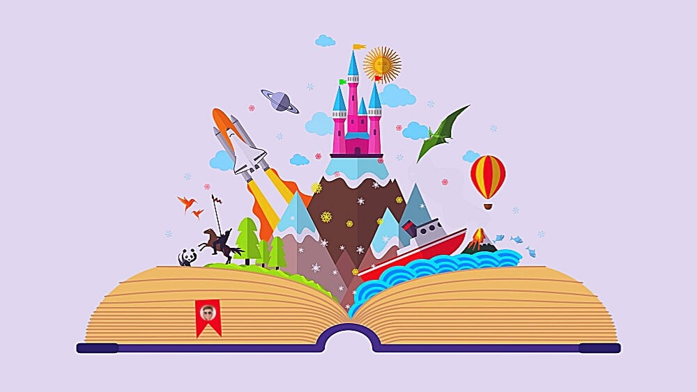

Scientific Report Data Practical 2
================
raphael\_krieg
19 juin 2022

``` r
library(ggplot2)
library(knitr)
library(dplyr)
```

# Storytelling

I will have the great opportunity to go to Norway the next semester in
order to study what role sorytelling has on the transmission of culture.

Storytelling is everywhere and seems to be directly tied to the human
capacity to speak. Form an evolution perspective, the art of
storytelling seems unadaptative at first glance. However, many studies
start to investigate the adaptative purpose of storytelling and its role
in our survival.

### A non exhaustive list of important questions storytelling asks

1.  Storytelling seems to be closely related to the ability of
    *imagination* and its tendency to develop very early in children.

2.  According do Lisa Cron (citation needed), our brain is litterly
    **wired** to enjoy stories. It craves for surpises and compelling
    plot devices.

3.  What is the purpose of stories? Why is it so important? How entire
    economic *monsters* (like Disney) feeds on our needs to watch, hear
    and take part in epic adventures along side
heroes?

## The book of imagination

<div class="figure">



<p class="caption">

Entire Worlds exist on paper

</p>

</div>

# How to load a DataSet ?

It’s easy to add so Code chunks and DataSets

``` r
data(discoveries)
str(discoveries)
```

    ##  Time-Series [1:100] from 1860 to 1959: 5 3 0 2 0 3 2 3 6 1 ...

``` r
glimpse(discoveries)
```

    ##  Time-Series [1:100] from 1860 to 1959: 5 3 0 2 0 3 2 3 6 1 ...

``` r
discoveries
```

    ## Time Series:
    ## Start = 1860 
    ## End = 1959 
    ## Frequency = 1 
    ##   [1]  5  3  0  2  0  3  2  3  6  1  2  1  2  1  3  3  3  5  2  4  4  0  2  3  7
    ##  [26] 12  3 10  9  2  3  7  7  2  3  3  6  2  4  3  5  2  2  4  0  4  2  5  2  3
    ##  [51]  3  6  5  8  3  6  6  0  5  2  2  2  6  3  4  4  2  2  4  7  5  3  3  0  2
    ##  [76]  2  2  1  3  4  2  2  1  1  1  2  1  4  4  3  2  1  4  1  1  1  0  0  2  0

``` r
kable(discoveries, col.names = c("Discoveries"))
```

| Discoveries |
| ----------: |
|           5 |
|           3 |
|           0 |
|           2 |
|           0 |
|           3 |
|           2 |
|           3 |
|           6 |
|           1 |
|           2 |
|           1 |
|           2 |
|           1 |
|           3 |
|           3 |
|           3 |
|           5 |
|           2 |
|           4 |
|           4 |
|           0 |
|           2 |
|           3 |
|           7 |
|          12 |
|           3 |
|          10 |
|           9 |
|           2 |
|           3 |
|           7 |
|           7 |
|           2 |
|           3 |
|           3 |
|           6 |
|           2 |
|           4 |
|           3 |
|           5 |
|           2 |
|           2 |
|           4 |
|           0 |
|           4 |
|           2 |
|           5 |
|           2 |
|           3 |
|           3 |
|           6 |
|           5 |
|           8 |
|           3 |
|           6 |
|           6 |
|           0 |
|           5 |
|           2 |
|           2 |
|           2 |
|           6 |
|           3 |
|           4 |
|           4 |
|           2 |
|           2 |
|           4 |
|           7 |
|           5 |
|           3 |
|           3 |
|           0 |
|           2 |
|           2 |
|           2 |
|           1 |
|           3 |
|           4 |
|           2 |
|           2 |
|           1 |
|           1 |
|           1 |
|           2 |
|           1 |
|           4 |
|           4 |
|           3 |
|           2 |
|           1 |
|           4 |
|           1 |
|           1 |
|           1 |
|           0 |
|           0 |
|           2 |
|           0 |
